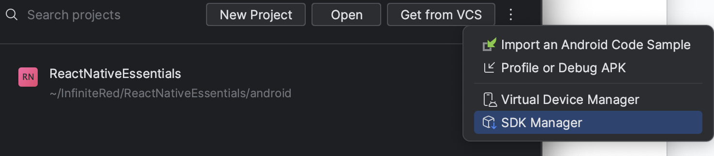

# Environment Setup Guide

In this guide, we'll go over the various tools, utilities, and software needed to successfully run/build a React Native project. This will produce a "bare minimum" setup that gets you going, but may not include _absolutely everything_ that will eventually be needed for all aspects of building a cross-platform application. Additionally, some choices may be opinionated; however, the intent is to get set up quickly and leave room for personal preference (we'll throw in some recommendations along the way). The starting point for some machines may differ, but we'll make the assumption of a fresh computer.

---

<details>
  <summary><strong>Table of Contents</strong></summary>

- [Environment Setup Guide](#environment-setup-guide)
  - [Prerequisites](#prerequisites)
    - [macOS](#macos)
    - [zsh](#zsh)
    - [sudo](#sudo)
  - [Utilities](#utilities)
    - [brew](#brew)
    - [watchman](#watchman)
    - [asdf](#asdf)
  - [Languages](#languages)
    - [Ruby](#ruby)
    - [Node](#node)
    - [Yarn Version 4](#yarn-version-4)
      - [via **asdf**](#via-asdf)
      - [via **npm/corepack**](#via-npmcorepack)
    - [Java](#java)
  - [IDEs](#ides)
    - [VS Code](#vs-code)
    - [XCode](#xcode)
      - [Command Line Tools](#command-line-tools)
      - [CocoaPods (optional)](#cocoapods-optional)
        - [via **bundle (Gemfile)**](#via-bundle-gemfile)
        - [via **ruby gem**](#via-ruby-gem)
        - [via **brew**](#via-brew)
    - [Android Studio](#android-studio)
      - [Android SDK](#android-sdk)
      - [Android AVD / Emulator](#android-avd--emulator)
  - [Confirm Successful Setup](#confirm-successful-setup)

</details>

---

## Prerequisites

### macOS

> An Apple Silicon based Mac is recommended. The more RAM the better.

When it comes to solely developing Android applications, most OSes will get the job done. However, with iOS, one of the requirements is to have the ability to run XCode for code-signing capabilities as well as creating simulators. This alone will be a blocker for anyone running something other than macOS and developing a React Native application using the "bare workflow".

### zsh

> **zsh** is the default shell on macOS 10.15.0 and above.

This isn't a prerequisite per se, but this guide will assume this is what's being used on the system. Some instructions may differ depending on the shell being used and how the paths are referenced/exported. So, just double check the steps as you're following them.

### sudo

Some software we'll be installing requires superuser privileges. Make sure you have this before continuing.

---

## Utilities

In this section we'll get you set up with the various utils needed to install the different programming languages and frameworks. Some of these tools are also not unique to React Native - you may find that you prefer similar alternatives to fit your workflow/preferences. Having said that, this will be the quickest setup for a fresh dev computer.

### brew

> Homebrew is a free and open-source software package management system that simplifies the installation of software on Apple's operating system, macOS, as well as Linux. <br/>https://brew.sh/

We'll be using brew to simplify the installation and management of other utils to get us going (e.g. watchman). This can also come in handy later for installing support packages for testing libraries, setting up deployments, etc. This is typically a one-step install process, but watch out for errors asking you to make additional changes to your path.

```bash
/bin/bash -c "$(curl -fsSL https://raw.githubusercontent.com/Homebrew/install/HEAD/install.sh)"

# restart shell, confirm installation
brew --version
```

Additionally, one of the post install steps for brew is setting up the brew env inside your `.zshrc`. This will give the rest of your `.zshrc` config access to software you have installed via brew.

```bash
# open ~/.zshrc and put at the top of the file:
eval "$(/opt/homebrew/bin/brew shellenv)"
```

**brew** can also be used to install and configure various programming languages; however, we'll be using a different tool for consistency and speed.

### watchman

> Watchman exists to watch files and record when they change. It can also trigger actions (such as rebuilding assets) when matching files change. <br/> https://facebook.github.io/watchman/

React Native uses watchman to detect changes in the app's source and execute a Fast Refresh. Fast refresh is a term that combines both concepts of "hot reloading" and "live reloading". Depending on the module you are working in, the app will update and push the bundle to your simulator/emulator/device with or without an app restart (see [Fast Refresh](https://reactnative.dev/docs/fast-refresh)).

```bash
brew install watchman

# restart shell, confirm installation
watchman --version
```

### asdf

> asdf is a CLI tool that can manage multiple language runtime versions on a per-project basis. It is like gvm, nvm, rbenv & pyenv (and more) all in one! Simply install your language's plugin! <br/> https://asdf-vm.com/

Nope, not a typo :) **asdf** is an all-in-one version manager for different languages, flavors, frameworks. Although **asdf** may not be your preferred way of installing these dependencies (e.g. [brew](#brew), nvm, chruby, etc), it has the most potential to keep all developers' env in sync (via a project level [`.tool-versions` file](https://asdf-vm.com/manage/configuration.html#tool-versions)). If you prefer to skip this step, be sure to have an equivalent capability for each language/framework.

```bash
brew install asdf

# update ~/.zshrc
echo -e "\n. $(brew --prefix asdf)/libexec/asdf.sh" >> ${ZDOTDIR:-~}/.zshrc
```

**Note:** If using [oh-my-zsh](https://ohmyz.sh/), you can configure your `~/.zshrc` file with the asdf plugin: `plugins=(asdf)`.

For more detailed installation instructions, follow the [installation guide](https://asdf-vm.com/guide/getting-started.html#getting-started) for your development environment.

```bash
# restart shell, confirm installation
asdf
```

When installing different runtimes with `asdf`, you have 3 options for setting the version of a language used. `asdf global [runtime] [version]` will set it globally for the entire system - this can be useful for certain languages like [node](#node) where certain tools will need it globally set (e.g. extensions in VS Code). `asdf local [runtime] [version]` will create a `.tool-versions` file in your current directory that will be referenced while in that directory or its children. `asdf shell [runtime] [version]` will specify the versions for the current shell session.

If a `.tool-versions` file is present in the directory you're in, as long as you have all of the necessary asdf plugins (see individual steps for [node](#node), [ruby](#ruby), and [java](#java)), you can run `asdf install` and it will automatically install any missing runtime versions.

If at any point you want to know which version you're currently using, you can run `asdf current`.

## Languages

Now that we have the utilities installed/configured, we can proceed with installing the required languages. We'll need Ruby, Java, and Node. You can set the installed language version globally if you prefer; however, the project will probably have its own `.tool-versions` file which will dictate the required versions at the time.

Note: Most plugins support builds for different architectures automatically. When installing the languages, keep an eye on the logs and make sure the correct arch is being installed for your system.

### Ruby

**Ruby** will mostly be used on the iOS side for CocoaPods dependency management. Additionally, if using [fastlane](https://fastlane.tools/) for deployments/automation, the scripts are all written in ruby. To install:

```bash
# first, add the asdf plugin
asdf plugin add ruby https://github.com/asdf-vm/asdf-ruby.git

# optional, see available ruby versions
asdf list-all ruby

# next, install ruby
asdf install ruby 3.2.2
# or, if within a dir with a .tool-versions file
asdf install

# optional, set global ruby version and confirm installation
asdf global ruby 3.2.2
ruby --version
```

Note: The install may err with a reference to missing system libs (depending on your machine). Most if not all missing libs can be installed with [brew](#brew).

### Node

**Node** will be used for bundling, running a dev server, and executing any scripts that are required by node dependencies/modules.

```bash
# add the asdf plugin
asdf plugin add nodejs https://github.com/asdf-vm/asdf-nodejs.git

# optional, see available node versions (LTS version recommended)
asdf list-all nodejs

# install node LTS
asdf install nodejs latest
# or, if within a dir with a .tool-versions file
asdf install

# optional, set global node version and confirm installation
asdf global nodejs latest
node --version
```

Note: As mentioned in the [asdf](#asdf) section, if you want different tools in your editor to work, you're going to need at least some version of node to be set globally on your system.

### Yarn Version 4

**Yarn** will be used to manage workspaces and node dependencies on the project. There are a few different ways to install yarn. These behave differently when it comes to caching globally installed packages.

#### via **asdf**

This will install yarn classic which then will allow us to install yarn version 4

```bash
# add the asdf plugin
asdf plugin-add yarn

# Install yarn classic v1.x.x
asdf install yarn latest
# or, if within a dir with a .tool-versions file
asdf install yarn

# Install yarn v4.x.x globally
# cd to your home folder
cd ~
# install the latest v4.x.x version
yarn set version stable
yarn --version
```

Note: This method requires gpg and tar for certificate validation. You can install them with [brew](#brew).

#### via **npm/corepack**

Corepack is a tool shipped by default with Node.js that allows to manage Yarn by project.

```bash
# Enable Corepack
corepack enable

# Install yarn version 4.x.x
yarn set version stable
yarn --version
```

### Java

This is needed for Android applications and gradle build steps. React Native setup instructions recommend JDK 11.

```bash
# add the asdf plugin
asdf plugin-add java https://github.com/halcyon/asdf-java.git

# optional, see available java versions
asdf list-all java

# install java
asdf install java zulu-17.46.19
# or, if within a dir with a .tool-versions file
asdf install

# update ~/.zshrc to set JAVA_HOME
echo '. ~/.asdf/plugins/java/set-java-home.zsh' >> ~/.zshrc

# enable macOS integration
echo "java_macos_integration_enable = yes" >> ~/.asdfrc

# optional, set global java version and confirm installation
asdf global java zulu-17.46.19
java --version
```

---

## IDEs

### VS Code

> Visual Studio Code is a code editor redefined and optimized for building and debugging modern web and cloud applications. <br/>https://code.visualstudio.com/

Although not a _true_ IDE, with the right set of extensions and settings, this can make the development of React Native projects more efficient and consistent. To setup VS Code, download the app from https://code.visualstudio.com/download. Note: be sure to select the correct architecture build for your system. Here are some recommended extensions and settings:

Extensions:

- ESLint
- GitLens
- Prettier
- Javascript and Typescript Nightly
- File Utils
- ruby-rubocop-revived (requires additional setup - follow extension instructions)
- SVG Preview
- Version Lens

Editor Settings:

- Add the shell command `code` by hitting ⌘⇧P and typing "Shell Command: Install `code` command in PATH".

Workspace Settings:

Create a `./vscode/settings.json` file. Here you can customize editor behavior for this project. Here are some recommended settings to get you started:

- This will auto-apply fixes on-save from the linter errors. Keep in mind, since prettier is configured as part of the linter, this will also apply the prettier rules to the files targetted by eslint.

  ```json
  {
    "editor.codeActionsOnSave": {
      "source.fixAll.eslint": true
    }
  }
  ```

- This will setup auto-formatting on-save for the specified file types to use the installed prettier extension. Since most files are already formatted via the linter, with this config we only target json and markdown files.
  ```json
  {
    "[json]": {
      "editor.defaultFormatter": "esbenp.prettier-vscode",
      "editor.formatOnSave": true
    },
    "[jsonc]": {
      "editor.defaultFormatter": "esbenp.prettier-vscode",
      "editor.formatOnSave": true
    },
    "[markdown]": {
      "editor.defaultFormatter": "esbenp.prettier-vscode",
      "editor.formatOnSave": true
    }
  }
  ```

Note: Keep in mind, the setting to run the auto-fix for the linter will also run prettier as part of eslint in addition to the standalone prettier

### XCode

**Xcode** will be used to build/run the iOS native side of the React Native application. It will also handle things like code-signing, asset management, simulators, and in some cases debugging.

To install Xcode, head over to the [Mac App Store](https://itunes.apple.com/us/app/xcode/id497799835?mt=12) and download the latest available version (usually dependent on OS version). It's recommended to upgrade the OS to the latest in order to have the latest Xcode. But first, check with the team to see what everybody is on. As of 05-31-23, the recommended version is 14.3.

#### Command Line Tools

By this point, you have probably incidentally installed the command line tools while installing other items prior. To verify, open Xcode -> Preferences -> Locations -> Command Line Tools. Select the latest version if not already selected.

#### CocoaPods (optional)

The reason this is optional is because most of the time, the React Native init script, or the commonly used node script `npx pod-install` will install CocoaPods CLI tool for you if it isn't there. If you want to control this step yourself, there are a few options:

##### via **bundle (Gemfile)**

If the project does not have a Gemfile, you can add one there or to a parent directory (e.g. `~/Dev`). Create a `Gemfile` with the following:

```ruby
source "https://rubygems.org"

gem "cocoapods"
```

Save the `Gemfile` and then inside of that directory run bundle. This will install the gem dependencies for the ruby version local to that directory. You can later add more dependencies here that you often use (e.g. fastlane).

Note: When running pod installation within your projects, you will need to use `bundle exec pod install` instead of `pod install` with this method.

##### via **ruby gem**

This will install cocoapods for the currently active [asdf](#asdf) [ruby](#ruby) version.

```bash
sudo gem install cocoapods
```

##### via **brew**

This is a global, system-level install via [brew](#brew).

```bash
brew install cocoapods
```

### Android Studio

**Android Studio** and its dependencies (adb, platform-tools, etc) will be used to build/run the Android native side of the React Native application. This will also be used to manage SDKs, create/edit emulators, and in some cases debugging.

To install Android Studio, download it from [Android Developers site](https://developer.android.com/studio). Be sure to select the architecture that matches your system. During the install wizard step, you can use the default values for SDK and AVD options (we'll modify these later). While waiting for the install to finish, go ahead and update your PATH:

```bash
# open ~/.zshrc
code ~/.zshrc

# paste the following lines in the file
export ANDROID_HOME=$HOME/Library/Android/sdk
export PATH=$PATH:$ANDROID_HOME/emulator
export PATH=$PATH:$ANDROID_HOME/platform-tools

# save file, restart shell, and verify
echo $ANDROID_HOME
```

Once the initial install completes, proceed to the next step.

#### Android SDK

On the Welcome screen, click on `More Actions -> SDK Manager`. It should look something like this:



Under Android 13 (Tiramisu), select the following (be sure to click on `Show Package Details` to be able to see the specific items listed below):

- Android SDK Platform 33
- Intel x86 Atom_64 System Image or Google APIs Intel x86 Atom System Image or (for Apple M1 Silicon) Google APIs ARM 64 v8a System Image

Under SDK Tools, make sure Android SDK Build Tools v34.0.0 and v33.0.X are selected.

Click "OK" to install.

#### Android AVD / Emulator

Unlike Xcode which has the Simulators preconfigured, you will need to create an emulator. On the Welcome screen, click `More Actions -> Virtual Device Manager`. Here you can configure your emulators with the desired settings (add a bit more RAM). Later, you can use the Virtual Device Manager for launching specific emulators.

---

## Confirm Successful Setup

At this point, follow the setup instructions below to confirm that everything has been setup correctly.

In your terminal, navigate to where you have this repo checked out:

```bash
cd ~/Dev
npx react-native init advancedcontacts # "y" to all prompts
cd advancedcontacts
```

Run the project setup script:

```bash
yarn
```

Start the metro bundler:

```bash
yarn start
```

Build in dev mode:

- Android: by typing `a` in metro, or in a new shell instance:

  ```bash
  yarn android
  ```

- iOS: by typing `i` in metro, or in a new shell instance:

  ```bash
  yarn ios
  ```
