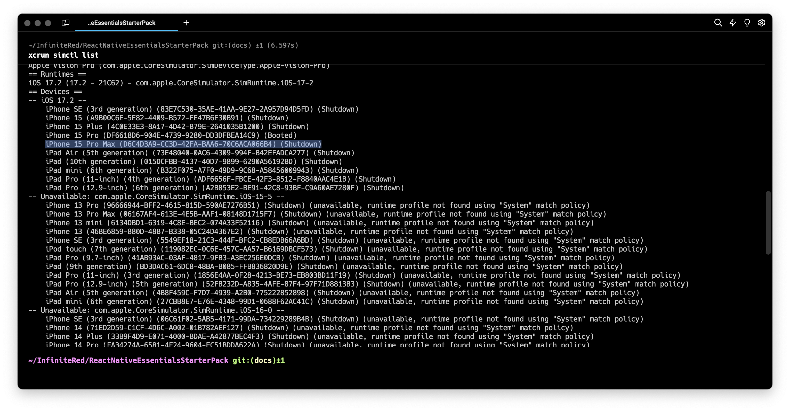

# Simulator & Emulator Setup

Since React Native targets both Android and iOS platforms by default, you have the capability of previewing your changes on both platforms at the same time. In this guide, we'll go over how to setup, manage, and work with both Simulators (iOS) and Emulators (Android).

---

  
<strong>Table of Contents</strong>

- [Simulator \& Emulator Setup](#simulator--emulator-setup)
  - [Differences](#differences)
  - [iOS](#ios)
    - [Runtime](#runtime)
    - [Destinations](#destinations)
    - [Launching a Specific Simulator](#launching-a-specific-simulator)
  - [Android](#android)
    - [Android Virtual Device](#android-virtual-device)
    - [Launching a Specific AVD](#launching-a-specific-avd)
      - [AVD Manager GUI](#avd-manager-gui)
      - [Emulator CLI tool](#emulator-cli-tool)
      - [`yarn android`](#yarn-android)
  - [Physical Devices](#physical-devices)

---

## Differences

The Android emulator replicates both the hardware and software of an Android device. It can mimic the device's processing speed and memory use, but struggles with accurately simulating more complex hardware, such as the GPU and certain media decoders. This replication process tends to consume a lot of resources and isn't perfectly synchronized with real-time operations.

On the contrary, the iPhone simulator only replicates the software environment of an iPhone. It does not mimic the specific hardware attributes of an iPhone like its processor or memory limits, but it leverages the hardware resources of the host system (the computer on which it runs). Although this approach may not give a precise reflection of an actual device's performance, it offers faster development cycles and improved support for development tools, boosting overall productivity.

There are also true Android phone emulators like BlueStacks, which go a step further than the standard Android emulator. However, it is almost always easier to connect a real Android phone and run the dev build on that.

## iOS

There are 2 components to what is known as a "simulator" - a runtime and a destination (simulated device). The runtime is the OS package that the Simulator app loads; the simulated device is a preconfigured set of capabilities, sizes, features that the runtime might use.

Xcode by default ships with a few destinations and runtimes already preconfigured for immediate development. There are times, however, when you might want to use a different screen size, test with or without a notch, or debug a runtime-specific issue.

### Runtime

Every version of Xcode will already have a built-in simulator runtime. To download an additional runtime:

- open XCode
- click Platforms (here you can preview the installed runtimes)
- click the "+" icon
- choose and download the preferred runtime

> Hint: You can type `xcrun simctl list` in your terminal to see a list of installed runtimes.

### Destinations

To manage your simulated devices:

- open XCode
- click on Product -> Destination -> Manage Run Destinations
- select the Simulators tab
- click the "+" icon
- choose which device type and OS version you'd like to pair

> Hint: You can also use the `xcrun simctl list` command to view the installed simulators.

### Launching a Specific Simulator

Now that you have a few simulators configured, it's time to do a new dev build that targets the new simulator. First, list out the list of simulators:

- `xcrun simctl list`

- Copy either the simulated device name (e.g. `iPhone 15 Pro Max`), or the UDID (e.g. `D6C4D3A9-CC3D-42FA-BAA6-70C6ACA066B4`).
- start the metro server: `yarn start`
- add the device target via flags:

  - `yarn ios --simulator "iPhone 15 Pro Max"`
  - `yarn ios --udid "D6C4D3A9-CC3D-42FA-BAA6-70C6ACA066B4"`

- alternatively, running `yarn ios --list-devices` will show you a list of devices you can choose for the build

> Hint: If you prefer to work on a specific simulator and don't want to hardcode the flags into the yarn script for everyone, you can recreate the Simulators list in XCode so that your preferred one is at the top of the list.

---

## Android

Android Emulator configuration is very similar to that of iOS, except you have a bit more options for customization. When creating an Android Virtual Device (AVD), you have the ability to choose the API level (not to be confused with Android version), the device profile (characteristics of the device you want to emulate), as well as other options related to the VM. The process also differs in a way that you can download the required runtime and create the AVD in one pass, rather than separately.

> Hint: If you're not sure which Android version equals an API level, a helpful table can be viewed on [Wikipedia](<https://en.wikipedia.org/wiki/Android_(operating_system)#Platform_information>).

### Android Virtual Device

To access the Android Virtual Device Manager:

- launch Android Studio
- click on the 3 vertical dots in the top right
- select Virtual Device Manager

Next, we'll create a new AVD:

- click Create Device
- select a preset Hardware Profile (or create a new one)
- in the next step, select the API level
- in the last step, you can click Show Advanced Settings to customize the VM

> Hint: If your computer can handle it and unless you're testing for a low RAM device, modify the RAM value to the largest value you're comfortable dedicating. This will speed up emulation significantly.

### Launching a Specific AVD

There are a few options for launching your new AVD.

#### AVD Manager GUI

- launch the AVD Manager you used to create the AVD
- click the play button next to the AVD you want to boot

> Hint: You can type `adb devices` to confirm that the ADV you want is attached.

#### Emulator CLI tool

You'll first need to get your AVD's ID.

- `emulator -list-avds`

Grab the ID and launch the desired AVD:

- `emulator -avd Pixel_6_Pro_API_33`

#### `yarn android`

This option works very similarly to iOS:

- `emulator -list-avds`
- copy the AVD id (e.g. `Pixel_6_Pro_API_33`)
- start the metro server: `yarn start`
- add the device target via flags:
  - `yarn android --deviceId Pixel_6_Pro_API_33`
- alternatively, running `yarn android --list-devices` will show you a list of devices you can choose for the build

## Physical Devices

It's always a good idea to test on a physical device before shipping. To do so, you'll need to enable developer mode on your device and connect it to your computer via USB. This is host platform and potentially device specific:

- [iOS](https://developer.apple.com/documentation/xcode/enabling-developer-mode-on-a-device)
- [Android](https://developer.android.com/studio/debug/dev-options)

A tool that is recommended to make physical device development easier is [Vysor](https://www.vysor.io/). It allows you to view and interact with your physical device from your desktop. Once you have this set up, follow the same steps as above, but choose your physical device as the target for either [Android](#yarn-android) or [iOS](#launching-a-specific-simulator).
